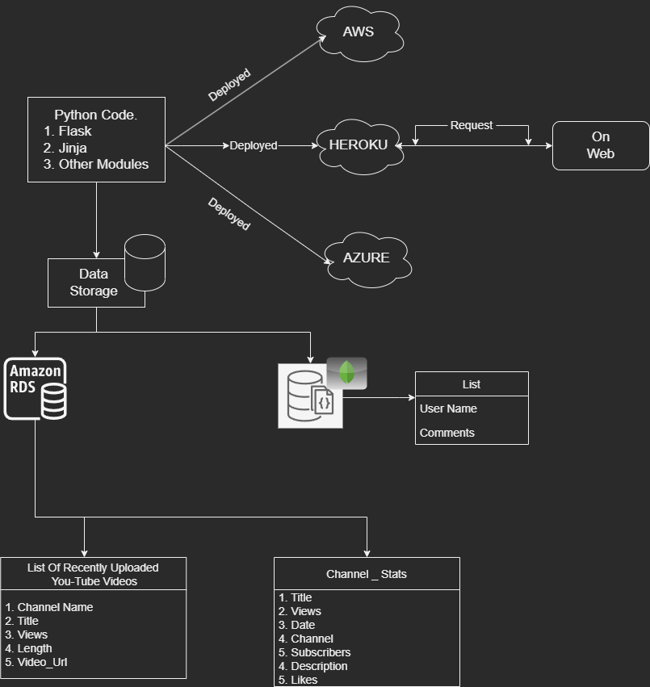

# YouTube_Scrapping_V2

This project scrapes You_tube channel Data

Uses Python and Flask at the backend and renderd result in the form of HTML pages.
The project architecture is shown in the image below.

